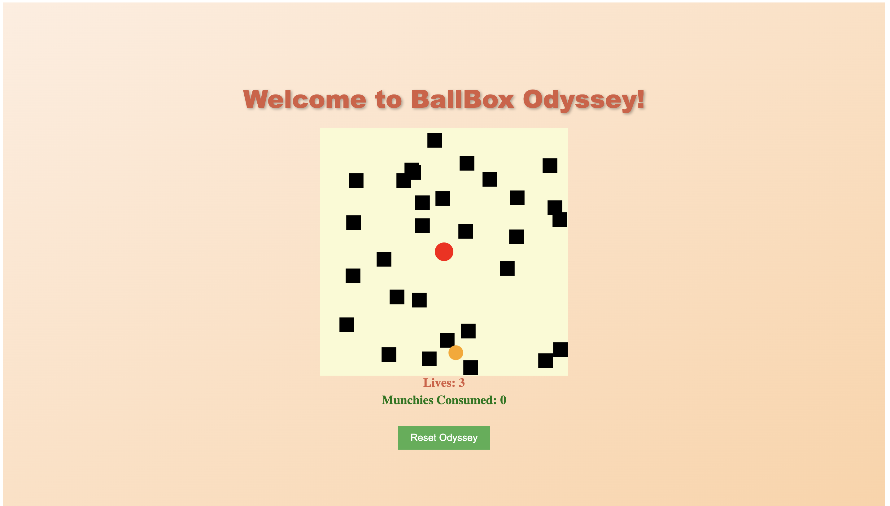

# BallBox Odyssey ⚽📦

Experience the comical adventure of BallBox Odyssey, a game where you take command of a ball inside a box. Harness your finger-tapping prowess to navigate the ball through perilous obstacles and collect delightful orange food items along the way. But beware! Mines are scattered throughout the box, ready to jeopardise your journey. Use the mighty arrow keys as your ultimate weapon to avoid collisions with the mines and guide the ball to victory!

## Project Description
- An basic game developed by myself to gain insights into building a simple web app using frontend languages. It serves as a learning project that showcases the implementation of fundamental concepts in web development
- Developed using a combination of HTML, CSS, and JavaScript
- Consists of three different files:
  - index.html (Defines the structure and layout of the game)
  - styles.css (Contains the CSS styles responsible for the visual appearance of the game elements)
  - script.js (Implements the game logic and controls user interactions)
- Deployed on the GitHub Pages platform

## How to Play
1. Navigate the ball within the box by using the arrow keys for movement
2. Avoid collision with mines, as it will reduce your lives.
3. Collect orange food items to increase your score.
4. Once you collect a food item, the position of mines will be relocated within the box.
5. The game ends when you lose all your lives.

Please note that this game is not playable on mobile devices.

##  Potential Enhancements for the Future
- **Introducing a level progression system.** Each level could introduce additional mines or increase the speed of the ball, challenging players to improve their skills as they advance. 
- **Enhancing visual elements.** Adding animations effects for actions like collecting food or colliding with mines would make the game more engaging and entertaining.
- **Adapting the game for mobile devices.** Implementing touch controls or creating a mobile-friendly version would allow players to enjoy the game on their smartphones or tablets. 

## Accessing BallBox Odyssey
To access BallBox Odyssey, simply visit the following website: https://sheng254.github.io/BallBoxOdyssey/

## Contributing
Contributions are welcome! Feel free to reach out with your suggestions, bug reports, or enhancement requests.

## License
This project is licensed under the [MIT License](LICENSE).
