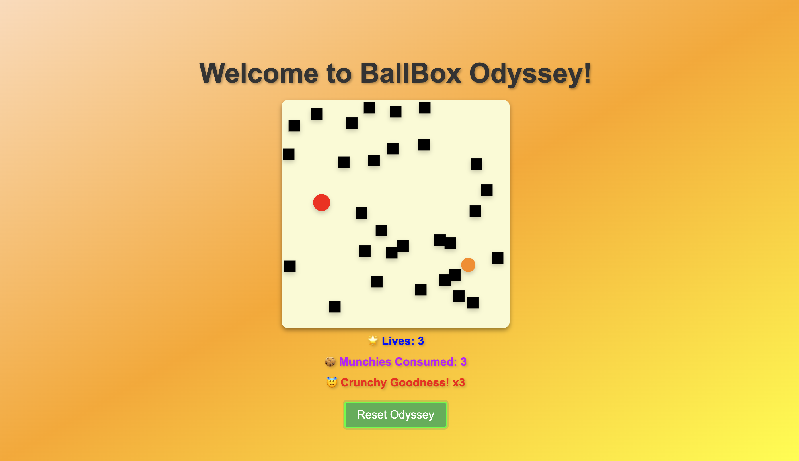

# BallBox Odyssey

Experience the comical adventure of BallBox Odyssey, a game where you take command of a ball inside a box. Harness your finger tapping prowess to guide the ball, utilising the mighty arrow keys as your ultimate weapon!

## Project Description
- An exceedingly basic game developed by myself to gain insights into building a simple web app using frontend languages. It serves as a learning project that showcases the implementation of fundamental concepts in web development.
- Developed using a combination of HTML, CSS, and JavaScript.
- Consists of three different files:
  - index.html (Defines the structure and layout of the game)
  - styles.css (Contains the CSS styles responsible for the visual appearance of the game elements.)
  - script.js (Implements the game logic and controls user interactions.)
- Deployed on the GitHub Pages platform for easy access.

## How to Play
Navigate the ball within the box by using the arrow keys for movement. Note that this game is not playable on mobile devices.

##  Potential Enhancements for the Future
-**Adding black boxes representing mines and a food item as rewards:** The objective of the player would be to collect the food while avoiding the mines. This addition would introduce strategic gameplay elements and make the experience more engaging.
-**Implementing a life system:** Adding a life system would bring an extra layer of challenge and consequence to the game. The player could start with a certain number of lives, such as three, and each time they touch a mine, they would lose one life. If all lives are depleted, the game would end. This would require careful decision-making and add a sense of urgency to the gameplay.
-**Introducing a level progression system:** To increase the game's difficulty and engagement, implementing a level progression system could be considered. Each level could introduce additional mines or increase the speed of the ball, challenging the player to improve their skills as they advance. This would provide a sense of accomplishment and encourage players to continue playing.
-**Enhancing visual and audio elements:** Improving the visual and audio elements of the game would contribute to a more immersive and enjoyable experience. Adding animations, particle effects, and sound effects for actions like collecting food or colliding with mines would make the game more engaging and entertaining. This would enhance the overall atmosphere and make the gameplay more exciting.
-**Adapting the game for mobile devices:** Broadening the accessibility and reach of the game by adapting it for mobile devices would be a valuable improvement. Implementing touch controls or creating a mobile-friendly version would allow players to enjoy the game on their smartphones or tablets. This would enable a larger audience to experience the game on their preferred devices.

## Accessing BallBox Odyssey
To access BallBox Odyssey, simply visit the following website: https://sheng254.github.io/BallBoxOdyssey/

## Contributing
Contributions are welcome! Feel free to reach out with your suggestions, bug reports, or feature requests.

## License
This project is licensed under the [MIT License](LICENSE).
